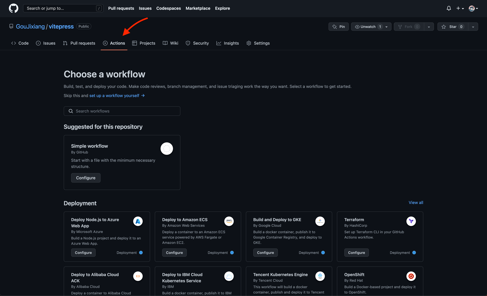

# Github Action 配置项目自动化部署至服务器

## 一、创建node.js.yml文件
### 1.1 选择repositories中的Actions标签页，并创建Node.js config

### 1.2 Smart commit node.js.yml
node.js.yml文件内容如下：
```yaml:line-numbers {1}
# This workflow will do a clean install of node dependencies, cache/restore them, build the source code and run tests across different versions of node
# For more information see: https://help.github.com/actions/language-and-framework-guides/using-nodejs-with-github-actions

name: Node.js CI
# on 表示触发actions的条件
on:
  push:
    branches: [ main ]  #main分支在push的时候会触发
  pull_request:
    branches: [ main ] #main分支在PR的时候会触发

jobs:
  build:

    runs-on: ubuntu-latest #nodejs执行的操作系统

    strategy:
      matrix:
        node-version: [18.x] #选择你需要的nodejs版本
        # See supported Node.js release schedule at https://nodejs.org/en/about/releases/

    steps:
      - uses: actions/checkout@v2
      - name: 使用 Node.js ${{ matrix.node-version }}开始搞事情
        uses: actions/setup-node@v2
        with:
          node-version: ${{ matrix.node-version }}
          cache: 'npm'
      - run: npm install
      - run: npm run docs:build
      - name: sync files
        uses: wangyucode/sftp-upload-action@v1.1
        with:
          host: ${{ secrets.SERVER_IP }}
          port: ${{ secrets.SERVER_PORT }}
          username: ${{ secrets.USERNAME }}
          password: ${{ secrets.PASSWORD }}
          localDir: "docs/.vitepress/dist"
          remoteDir: ${{ secrets.SERVER_DESTINATION }}
      - name: restart nginx.service
        uses: appleboy/ssh-action@master
        with:
          host: ${{ secrets.SERVER_IP }}
          port: ${{ secrets.SERVER_PORT }}
          username: ${{ secrets.USERNAME }}
          password: ${{ secrets.PASSWORD }}
          script:
            systemctl restart nginx

```
## 二、创建秘钥

## 三、服务器安装node、nginx及配置
