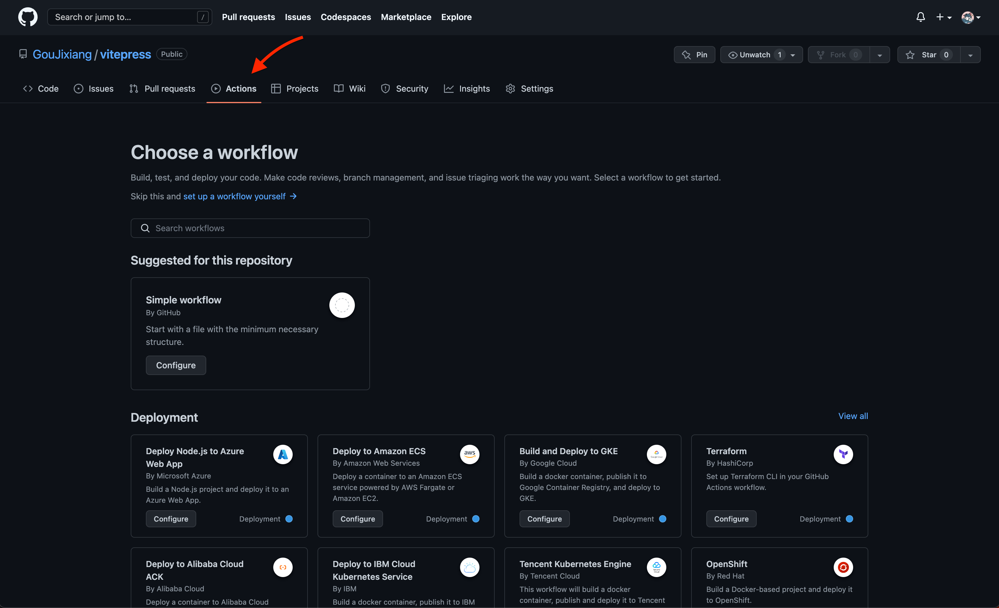
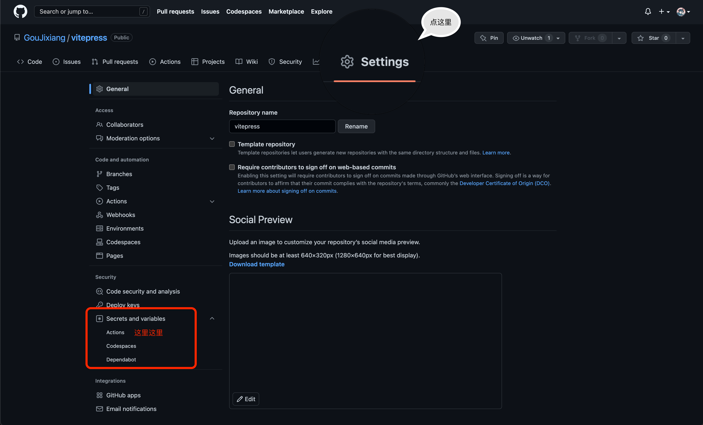

# Github Action 配置项目自动化部署至服务器

## 一、创建node.js.yml文件
### 1.1 选择repositories中的Actions标签页，并创建Node.js config

### 1.2 Smart commit node.js.yml
node.js.yml文件内容如下：
```yaml:line-numbers {1}
# This workflow will do a clean install of node dependencies, cache/restore them, build the source code and run tests across different versions of node
# For more information see: https://help.github.com/actions/language-and-framework-guides/using-nodejs-with-github-actions

name: Node.js CI
# on 表示触发actions的条件
on:
  push:
    branches: [ main ]  #main分支在push的时候会触发
  pull_request:
    branches: [ main ] #main分支在PR的时候会触发

jobs:
  build:

    runs-on: ubuntu-latest #nodejs执行的操作系统

    strategy:
      matrix:
        node-version: [18.x] #选择你需要的nodejs版本
        # See supported Node.js release schedule at https://nodejs.org/en/about/releases/

    steps:
      - uses: actions/checkout@v2
      - name: 使用 Node.js ${{ matrix.node-version }}开始搞事情
        uses: actions/setup-node@v2
        with:
          node-version: ${{ matrix.node-version }}
          cache: 'npm'
      - run: npm install
      - run: npm run docs:build
      - name: sync files
        uses: wangyucode/sftp-upload-action@v1.1
        with:
          host: ${{ secrets.SERVER_IP }}
          port: ${{ secrets.SERVER_PORT }}
          username: ${{ secrets.USERNAME }}
          password: ${{ secrets.PASSWORD }}
          localDir: "docs/.vitepress/dist"
          remoteDir: ${{ secrets.SERVER_DESTINATION }}
      - name: restart nginx.service
        uses: appleboy/ssh-action@master
        with:
          host: ${{ secrets.SERVER_IP }}
          port: ${{ secrets.SERVER_PORT }}
          username: ${{ secrets.USERNAME }}
          password: ${{ secrets.PASSWORD }}
          script:s
            systemctl restart nginx

```
## 二、创建秘钥

::: tip
这里需要根据node.js.yml中的占位符，配置相应的参数！
:::
## 三、服务器安装node、nginx及配置
::: info
本教程使用Debian服务器，nodejs版本为18.x，默认nginx已安装
:::
### 3.1 安装nodejs
```shell
curl -fsSL https://deb.nodesource.com/setup_18.x | bash - &&\
apt-get install -y nodejs
```
### 3.2 配置nginx
```
http {
   server {
        # 监听的端口号
        listen       80;

        # 服务名称 生产环境要修改成 公网ip
        server_name  localhost;

        # 配置根目录的地址是以 nginx 下的 html 文件夹为根目录来查找的
        root html;

        # 配置默认的主页显示 比如 47.105.134.120:8080 显示的 index 页面
        location / {
            try_files $uri $uri/ /index.html;	    
        }
        # 配置我们的 admin 的前台服务
        location ^~ /admin {
            # 处理 Vue 单页面应用 路由模式为 history 模式刷新页面 404 的问题
            try_files $uri $uri/ /index.html;
        }
        # 如果你想配置多个项目的话，可以复制上面的，修改一下就可以同时部署多个前端项目了
        # 比如
        # location ^~ /blog {
            # 处理 Vue 单页面应用 路由模式为 history 模式刷新页面 404 的问题
            # try_files $uri $uri/ /blog/index.html;
        # }
        #error_page  404              /404.html;

        # redirect server error pages to the static page /50x.html
        #
        error_page   500 502 503 504  /50x.html;
        location = /50x.html {
            root   html;
        }
    }

    include servers/*;
}
```
## 四、测试
本地修改文件并push，观察服务器上的文件是否刷新！